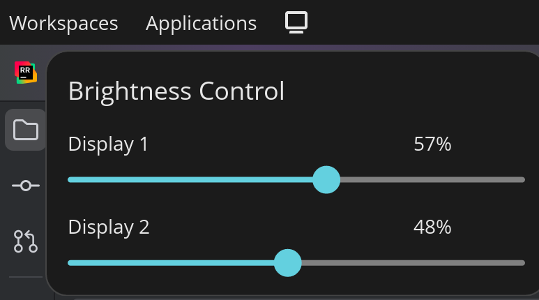

# Cosmic Apple Studio Display Control

A native COSMIC panel applet for controlling Apple Studio Display and Apple Pro XDR Display brightness on Linux. 



## Supported Devices

- Apple Studio Display 27" (2022) - Product ID: 0x1114
- Apple Pro XDR Display 32" (2019) - Product ID: 0x9243

## Requirements

### System Dependencies

On Pop!_OS or Ubuntu with COSMIC desktop:

```bash
sudo apt install cargo cmake just libexpat1-dev libfontconfig-dev libfreetype-dev libxkbcommon-dev pkgconf
```

### udev Rules (Required)

You need to set up udev rules to allow access to the HID devices.

**Easy Install:**


```bash
sudo ./install-udev-rules.sh
```

**Manual Install:**

<details>
<summary>Click to expand manual installation instructions</summary>

**For Apple Studio Display (2022, 27")**

Create `/etc/udev/rules.d/50-apple-studio.rules`:

```bash
sudo tee /etc/udev/rules.d/50-apple-studio.rules <<EOF
KERNEL=="hiddev*", ATTRS{idVendor}=="05ac", ATTRS{idProduct}=="1114", GROUP="users", OWNER="root", MODE="0660"
EOF
```

**For Apple Pro XDR Display (2019, 32")**

Create `/etc/udev/rules.d/50-apple-xdr.rules`:

```bash
sudo tee /etc/udev/rules.d/50-apple-xdr.rules <<EOF
KERNEL=="hiddev*", ATTRS{idVendor}=="05ac", ATTRS{idProduct}=="9243", GROUP="users", OWNER="root", MODE="0660"
EOF
```

**Reload udev rules:**

```bash
sudo udevadm control --reload-rules
sudo udevadm trigger
```

</details>

**Note:** You may need to log out and back in for the permissions to take effect.

## Installation

### From Source

```bash
# Clone the repository
git clone https://github.com/snipesy/cosmic-applet-asdcontrol.git
cd cosmic-applet-asdcontrol

# Install udev rules (required for HID access)
sudo ./install-udev-rules.sh

# Build and install the applet
cargo build --release
cargo install --path . # Installs to cargo bin
./install.sh
```

The install script will copy the desktop file to `~/.local/share/applications/`.

Log out and back in after installing udev rules for the first time.

## Usage

1. **Add the applet to your panel:**
   - Open COSMIC Settings
   - Navigate to **Desktop** > **Panel** > **Configure panel applets** (may change in future)
   - Find "ASD Brightness Control" and add it to your panel (you can pick where it goes)

2. **Control brightness:**
   - Click the display icon in your panel
   - A popup will appear with sliders for each detected Apple display
   - Adjust the slider to change brightness (0-100%)
   - Changes are debounced and applied smoothly

## Troubleshooting

### No devices detected

1. Verify your display is connected and powered on
2. Check that udev rules are installed:
   ```bash
   ls -l /etc/udev/rules.d/50-apple-*.rules
   ```
3. Verify the hiddev devices exist:
   ```bash
   ls -l /dev/usb/hiddev* /dev/hiddev*
   ```
4. Check permissions on hiddev devices - they should be readable/writable by your user
5. Try reloading udev rules and logging out/in

### Applet doesn't appear in panel

1. Ensure the binary is in your PATH:
   ```bash
   which cosmic-applet-asdcontrol
   ```
2. Check the desktop file exists:
   ```bash
   ls -l ~/.local/share/applications/cosmic-applet-asdcontrol.desktop
   ```
3. Restart the COSMIC panel or log out/in

### Debug mode

Run the applet directly from the terminal to see debug output:

```bash
./target/debug/cosmic-applet-asdcontrol
```

or

```bash
cosmic-applet-asdcontrol
```

## Credits

Inspired by:
- [asdcontrol](https://github.com/nikosdion/asdcontrol) by Nicholas K. Dionysopoulos
- [asdcontrol-gnome](https://github.com/sznowicki/asdcontrol-gnome) by sznowicki
